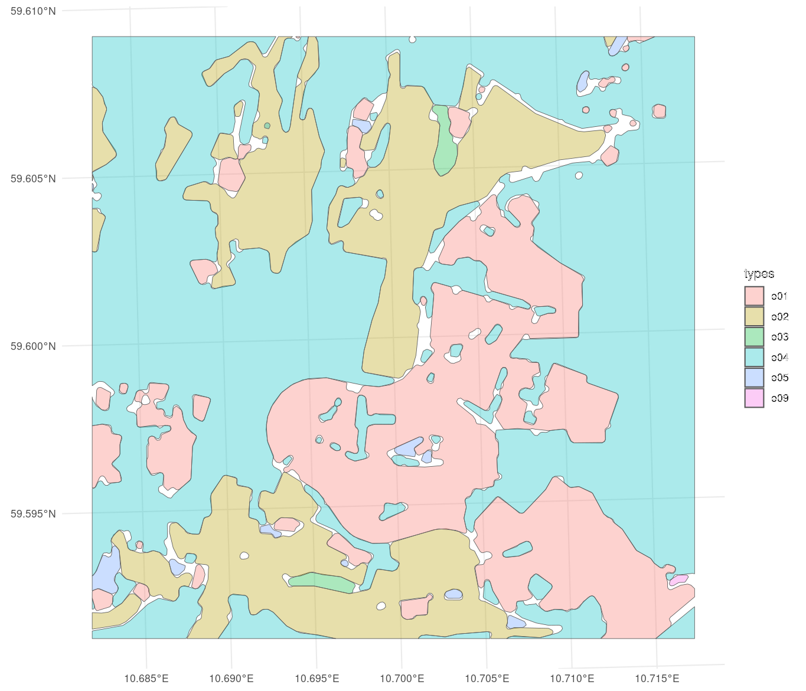

## Turning the simplified masks into a comprehensive partition/tessellation 

### Balint (2026.08.10)

> It seems that my EDDE morphological filters have quite nicely simplified the complex input geometries of the Norwegian Grunnkart, 
> and they now provide quite a nice almost-partition with no overlaps and relatively few gaps -- see the attached image. 
> Do you have an idea for a series of operations that I could use in R & duckspatial which could fill in the gaps meaningfully? 
> (E.g. to divide them between the adjacent polygons, so that the result would be a perfect partition...?) In principle the method 
> should scale well to entire Norwegian fylkes (~100000 polygons) on a relatively powerful server (96 cores, 1000 GB ram)
> 
> (The scripts & the readme you can find here are outdated, they are only useful for a general insight in the approach /goals... 
> but the figure tells it better what I want.)
> 
> Thanks for a joint brainstorming!




### Claude Opus 5.8

Great problem — and the figure makes it crystal clear. What you're describing is a classic nearest-feature (Euclidean) allocation problem: 
every empty cell in a gap should go to the ET whose boundary is closest, and where two ETs are equidistant you get the medial axis 
of the gap as the new shared border. Below are a few ways to do it in R/duckspatial, from "conceptually exact" to "cheap and good-enough", 
plus how to make it scale to a whole fylke.

#### The core idea
Because your morphological filters removed every feature/gap narrower than th_morph = 20 m, all your gaps are thin 
(bounded by 2+ ET polygons, mostly <20 m wide). That means:

* Splitting a gap along the medial axis ≈ assigning each sub-area to its nearest ET. 
This is exactly what a Voronoi diagram of the surrounding boundary geometry, clipped to the gap, gives you.
* The error of any cruder shortcut is bounded by the gap width, which is small.

#### Recommended vector approach: Voronoi allocation

1. Extract the gaps as their own features. Work per method (all 7 s1 masks are mutually disjoint; likewise s2):
```
-- U = union of all ET masks for one method
-- domain = U with interior holes filled (so you only grab interior white spots,
--          not the exterior of the study area)
-- gaps = ST_Difference(domain, U), then ST_Dump to individual polygons
```
    To fill holes: take ST_Dump(U), rebuild each part from its exterior ring, union → domain. gaps are the interior white spots only.

2. Collect local boundary points near each gap. For a gap g, take the ET polygons that touch it (ST_Intersects(mask, ST_Buffer(g, ~th_morph))), 
take ST_Points(ST_Boundary(mask)), and tag each point with its ET id (e01…e07). Densify first if your vertices are sparse (see caveats).

3. Voronoi + clip + dissolve:
```
-- pts: MultiPoint of tagged boundary vertices around gap g
-- cells = ST_Dump(ST_VoronoiDiagram(pts))
-- tag each cell with the ET id of the point it contains (spatial join)
-- allocation = ST_Intersection(cell, g), dissolved by ET id
```
    Each gap is thereby split among its neighbours along the medial axis.

4. Merge the allocated slivers back into the masks: ST_Union per ET id. Result → perfect partition.


#### Make it scale (100k polygons, 96 cores)

The key: the problem is embarrassingly parallel per gap. Each gap only interacts with its immediate neighbours, so:

* After step 1, you have thousands of tiny independent gaps. Process them in parallel (e.g. future.apply/furrr over gap ids, 
or a partitioned DuckDB query). Each Voronoi call operates on a few hundred points → milliseconds.
* Avoid one giant Voronoi over the whole fylke (millions of points) — do it gap-local.
* If you'd rather tile spatially, tile with an overlap buffer ≥ max gap width and clip results to tile cores to avoid seam artifacts.


#### Cheaper alternatives (worth it as a hybrid)
(a) Longest-shared-boundary, whole-gap assignment. For each gap, measure shared boundary length with each neighbour 
(ST_Length(ST_Intersection(ST_Boundary(gap), mask))) and assign the whole gap to the max. Since gaps are <20 m wide, the error 
is tiny and this is trivially fast and parallel. It doesn't divide gaps, so it's slightly less "meaningful" for the occasional larger blob.

Hybrid (my actual recommendation): route small / 1–2-neighbour gaps through (a), and only send larger or ≥3-neighbour gaps through the Voronoi split. Most of your gaps are slivers, so you spend compute only where division actually matters.

(b) Raster Euclidean allocation (sanity check / fallback). Rasterize the level-1 ET map at 1–2 m (terra), 
run nearest-ET allocation (terra::distance/gridDist with targets, or a proximity/growth), keep only the reclassified 
gap cells, polygonize back. This is O(n), trivially parallel, and gives essentially the exact nearest-ET answer. Since you're 
already in a metric CRS (25833), it's a clean, robust cross-check on the vector result even if you ship the vector version.


#### Practical caveats

* ST_VoronoiDiagram is GEOS-backed and needs a recent DuckDB spatial (GEOS ≥ 3.12). It returns a GEOMETRYCOLLECTION and loses the input→cell link, so recover the ET id by spatially joining each cell to the point it contains.
* Densification: Voronoi quality depends on point spacing along boundaries. Your buffer-derived polygons already have many rounded vertices, so existing ST_Points may suffice; if not, densify boundary segments to ≤ a few metres before extracting points. Check whether your DuckDB build exposes ST_Segmentize/line-interpolation; if not, densify in R (sf::st_segmentize) on just the gap-adjacent boundaries.
* Only fill interior gaps, never the outer edge — hence the "fill holes to get domain" step. Also decide what to do where a gap touches the study-area border or a non-terrestrial ET (e08–e12): you probably want to exclude those from allocation so you don't grow terrestrial ETs into water.
* Overlaps: you said there are none within a method — good, that keeps this to a pure allocation problem. If tiny topological overlaps sneak in, resolve them first (e.g. ST_Difference in a fixed ET priority order) so the input is a clean disjoint set.
* Validity: run ST_MakeValid on masks before all of this; buffer/erosion outputs occasionally carry slivers or self-touches that break Voronoi.

Want me to sketch a concrete runnable duckspatial + furrr pipeline for one fylke (gap extraction → hybrid allocation → re-merge) that you could drop next to the existing scripts?